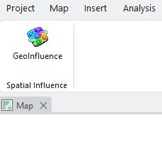
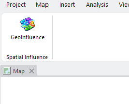
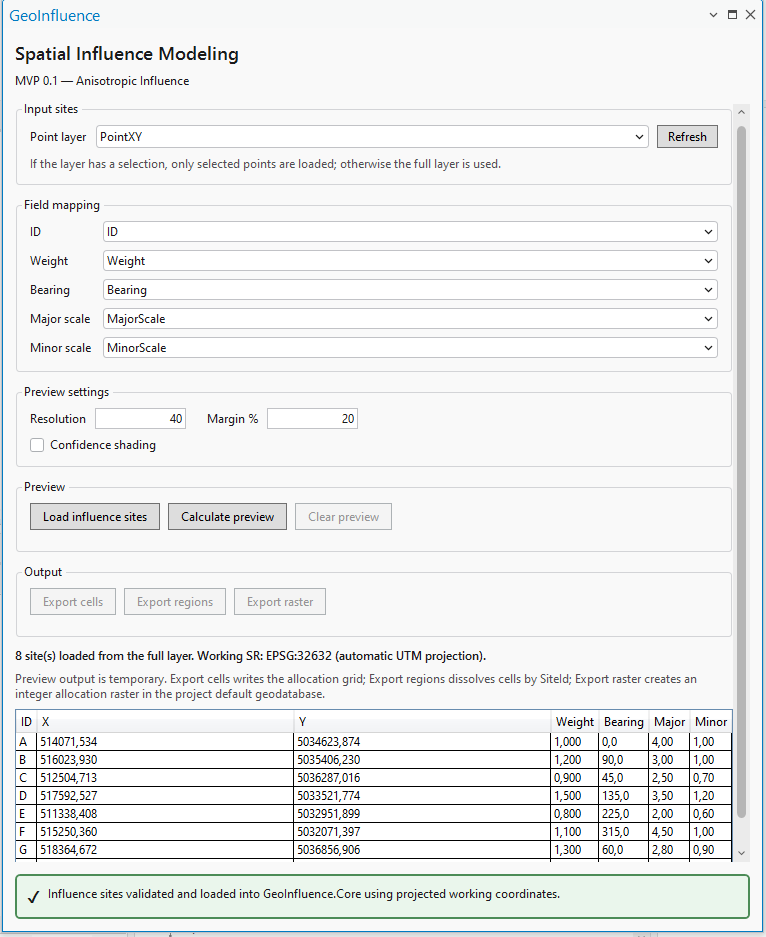
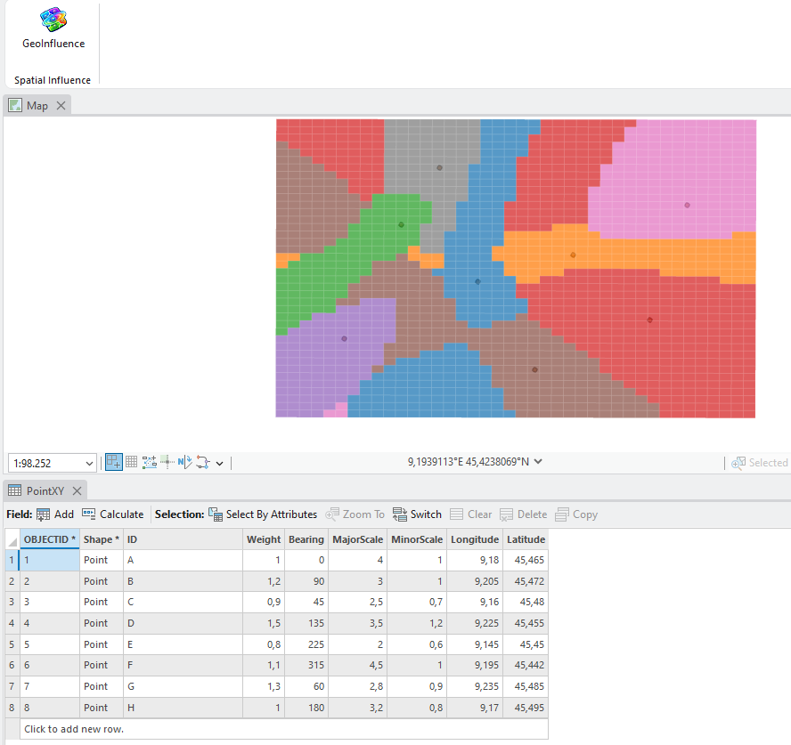
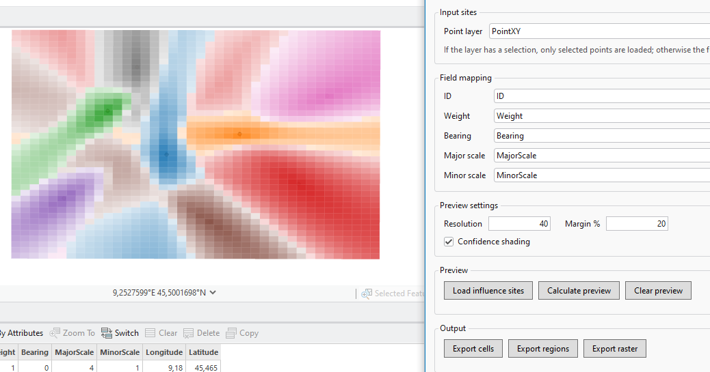
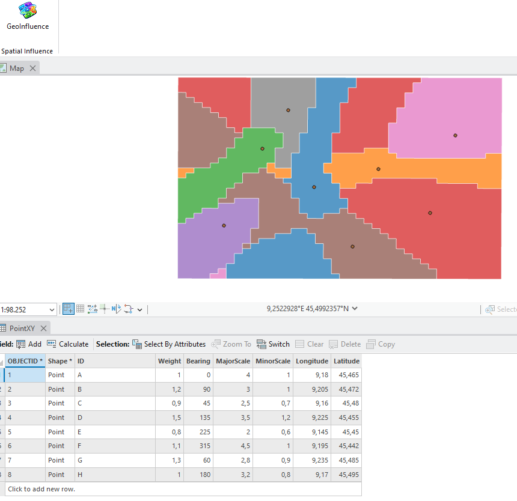
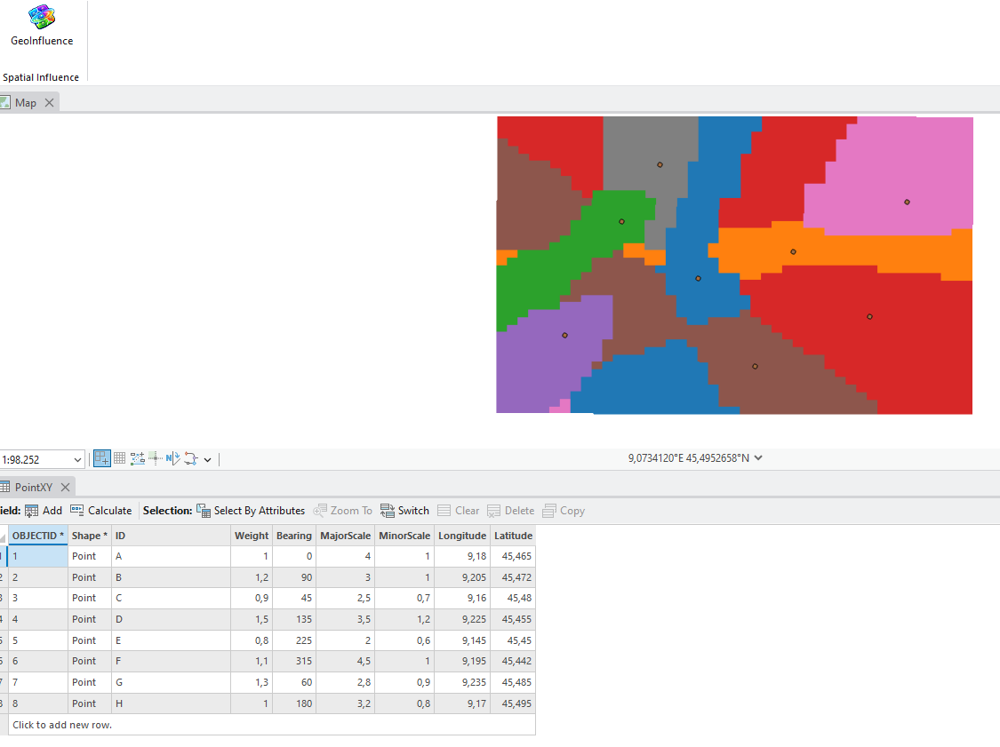

# GeoInfluence screenshots

## Ribbon — dark theme

## Ribbon — light theme

## Dock pane and input mapping

## Allocation preview

## Confidence preview

## Dissolved influence regions

## Raster output

